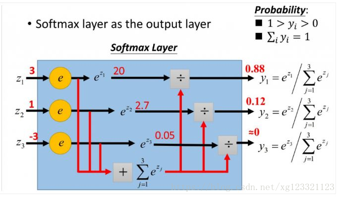

# 目标检测分类任务的loss函数

## &emsp;&emsp; 分类问题的目标变量是离散的，神经网络模型的效果及优化的目标就是通过自定义损失函数来定义的。

## &emsp;&emsp;分类问题常用的损失函数为交叉熵(Cross Entropy Loss)。

## &emsp;&emsp;交叉熵描述了两个概率分布之间的距离，当交叉熵越小说明两者之间越接近。尽管交叉熵刻画的两个概率分布之间的距离,但是神经网络的输出却不一定就是概率分布，为此我们常常使用Softmax回归任务将神经网络前向传播得到的结果变成概率分布。
  
## &emsp;&emsp;Softmax常用于多分类的问题，它将多个神经元的输出归一化到(0,1)之间，因此Softmax的输出可以看成是概率，从而进行多分类。
  
## &emsp; &emsp;假设我们有一个包含K个元素的数组V,i表示V中的第i个元素，那么这个i元素的Softmax就是

 

## &emsp; &emsp;下图是关于Softmax过程图

## &emsp; &emsp; Softmax 前面一层一般为全连接层，全连接层的作用就是就是分类，在这里数组V包含3个元素，对应的分类个数就是3类，Softmax的作用就是计算属于3类中的概率。使用e次方的作用就是将值全连接层中的值归一化到(0,1)之间。<!---->  
* 注意在Tensorflow在TensorFlow中使用Cross Entropy Loss时，主要是使用tf.nn.softmax_cross_entropy_with_logits这类函数，但这类函数需要输入的是未经过Softmax的Logits。而所谓的unscaled logits就可以粗略理解为没有经过Softmax的变量。这一点要与数学上的logits ( 一个事件发生与该事件不发生的比值的对数) 进行区分

## tf.nn.softmax_cross_entropy_with_logits
* 第一个参数logits：就是神经网络最后一层的输出，一般为全连接层的输出，如果有batch的话，它的大小就是[batchsize，num_classes]，单样本的话，大小就是num_classes
* 第二个参数labels：实际的标签，大小同上

