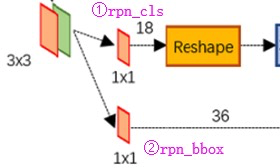

<!-- update 论文笔记  faster-rcnn-->
# 
 Faster-RCNN 论文阅读 

## &emsp;&emsp; Faster-RCNN是典型two-stage检测法，就是将检测问题分为两个阶段，首先是生成候选区域，然后对候选区域进行分类，是先做检测，然后在做分类。不像SSD和YOLO同时进行分类和检测，loss是两者的loss相加。典型的算法就是R-CNN系列，Faster-RCNN就是基于region proposal的目标检测---Faster-RCNN。

## &emsp;&emsp; Faster-RCNN 主要一共分为四个部分。

## &emsp;&emsp; 主干网络提取特征层，可以使用VGG或者是Resnet,目的就是为了提取特征
## &emsp;&emsp; RPN(区域生成网络)，RPN是Faster-RCNN中的核心，对于候选框生成提供了一种更好的方法，RPN网络的结构图如下图

## &emsp;&emsp; Faster-RCNN 的核心是RPN，区域生成网络。[关于RPN的结构可以参考这边文章](https://www.cnblogs.com/wangyong/p/8513563.html)

## &emsp;&emsp; RPN生成的框可以看做是Anchors，特征可以看做一个尺度W✖️H✖️C通道的图像，对于该图像的每一个位置，考虑有9个可能的候选框,三种尺度{128,256,512}和三种比例{1:1,1:2,2:1}，对于特征图上的每个点都会生成9个Anchor Boxes，尺度对应的Anchor是边长, 这个尺寸大小是对应原图的大小。如果对应到特征图[8,16,32]
